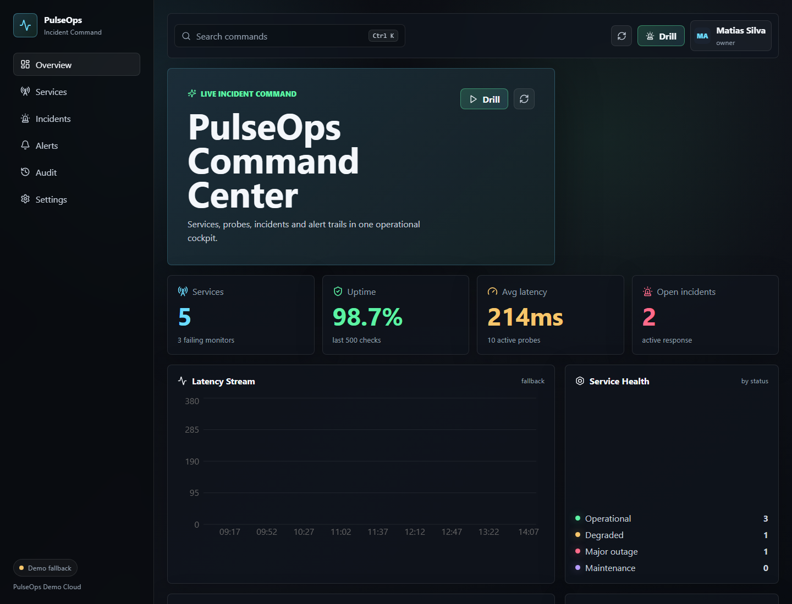
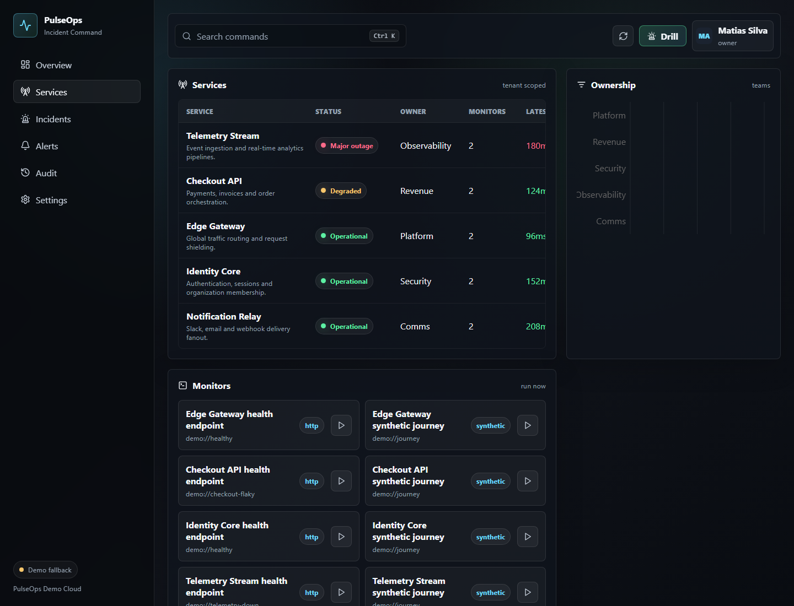
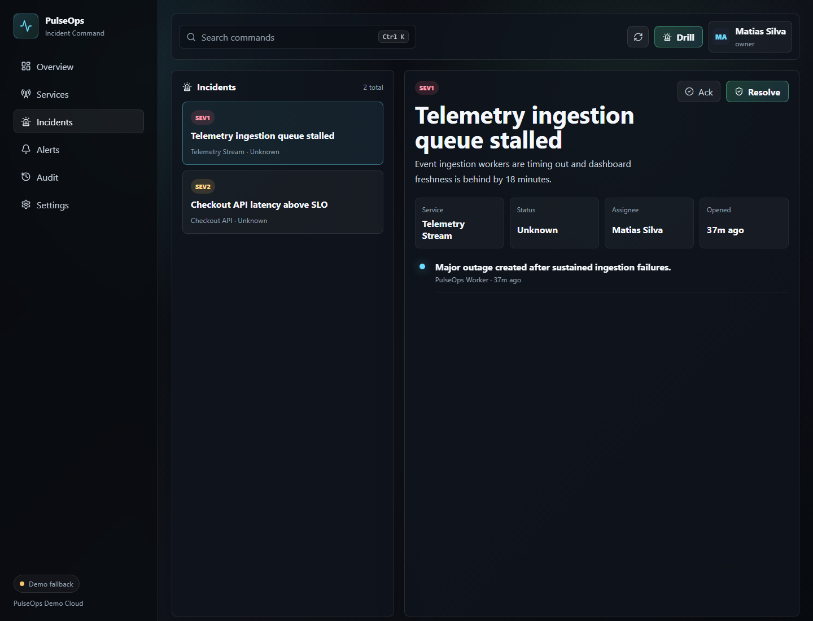
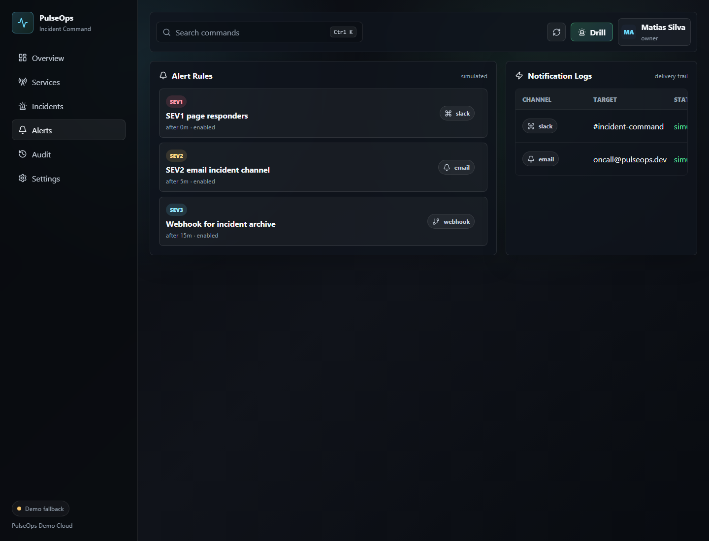
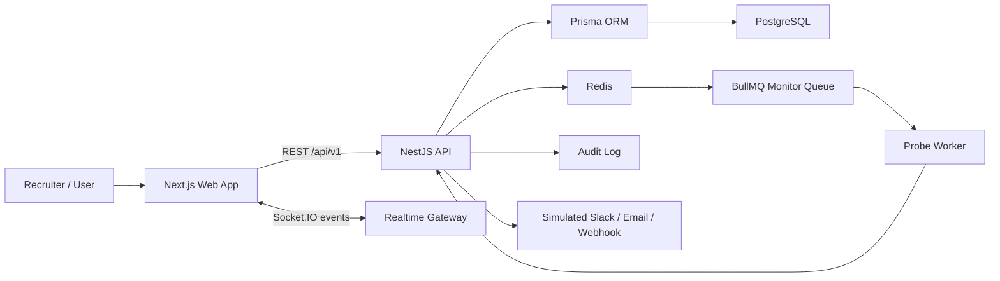
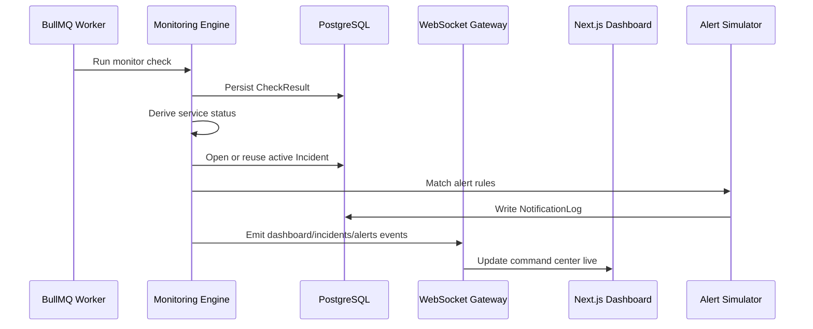
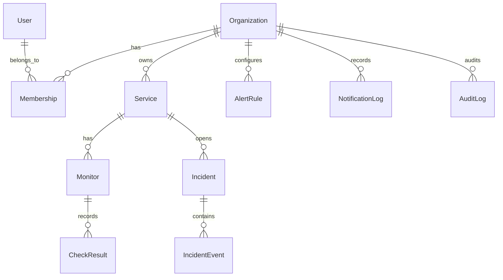

# PulseOps: DevOps Incident Command Center

PulseOps is a recruiter-ready full-stack SaaS portfolio project: a DevOps incident command center for monitoring services, investigating outages, coordinating responders and auditing alert delivery.

It is designed to show both sides of full-stack work:

- a polished operational UI that feels like a real product, not a tutorial dashboard;
- a real backend architecture with authentication, tenant isolation, monitors, workers, WebSockets, audit logs and incident workflows.

> Public demo: deployed as a curated recruiter walkthrough. The full backend runs locally with PostgreSQL and Redis.

## Screenshots



| Services | Incidents |
| --- | --- |
|  |  |

| Alerts |
| --- |
|  |

## Recruiter Brief

PulseOps demonstrates practical senior-level product engineering:

- **Frontend product craft:** dense dashboard layout, responsive app shell, command palette, charts, service map, incident timeline, alert logs and fallback demo mode.
- **Backend architecture:** NestJS API, Prisma data model, PostgreSQL persistence, Redis-backed BullMQ workers, Socket.IO events, JWT/httpOnly sessions and OpenAPI docs.
- **SaaS fundamentals:** organizations, memberships, roles, tenant-scoped reads/writes, audit trails and realistic seed data.
- **Operational workflows:** scheduled probes, check history, derived service health, incident deduplication, alert rule matching and simulated Slack/email/webhook delivery.
- **Engineering hygiene:** TypeScript strict mode, monorepo boundaries, shared domain contracts, linting, build validation and unit tests for core behavior.

## Architecture



## Incident Workflow



## Data Model



## Product Surface

The app includes:

- **Overview:** service health, uptime, latency stream, incident queue and service map.
- **Services:** tenant-scoped service inventory with monitor status and ownership.
- **Incidents:** priority queue, severity chips, responder assignment, status transitions and timeline events.
- **Alerts:** alert rules plus simulated notification logs for Slack, email and webhooks.
- **Audit:** append-only operational trail for auth, checks, service changes, incidents and alerts.
- **Settings:** active user/org context and API surface summary.

## Backend API

Main REST surface:

- `POST /api/v1/auth/login`
- `POST /api/v1/auth/logout`
- `GET /api/v1/me`
- `GET /api/v1/dashboard`
- `GET /api/v1/services`
- `POST /api/v1/services`
- `GET /api/v1/services/:id/checks`
- `GET /api/v1/monitors`
- `POST /api/v1/monitors/:id/run`
- `GET /api/v1/incidents`
- `POST /api/v1/incidents`
- `PATCH /api/v1/incidents/:id`
- `POST /api/v1/incidents/:id/events`
- `GET /api/v1/alert-rules`
- `POST /api/v1/alert-rules`
- `GET /api/v1/notifications/logs`
- `GET /api/v1/audit-logs`

Realtime channels:

- `dashboard.updated`
- `monitor.check.completed`
- `incident.created`
- `incident.updated`
- `alert.sent`

## Technical Decisions

- **TypeScript full stack:** one language across UI, API and shared contracts.
- **Monorepo:** `apps/web`, `apps/api` and `packages/shared` keep product surfaces separate while sharing domain types.
- **Prisma + PostgreSQL:** relational model fits tenant ownership, incident history and auditability.
- **Redis + BullMQ:** monitor checks are background work, not request/response work.
- **Socket.IO:** dashboard changes should feel live without refresh loops.
- **Public demo fallback:** recruiters can open the public deployment instantly; the local app can connect to the real backend.

## Local Development

The local demo uses Docker for PostgreSQL and Redis. Demo credentials:

- Email: `matias@pulseops.dev`
- Password: `pulseops-demo`

```bash
corepack pnpm install
copy .env.example .env
docker compose up -d
corepack pnpm db:generate
corepack pnpm db:migrate
corepack pnpm db:seed
corepack pnpm dev
```

Local URLs:

- Web app: `http://localhost:3000`
- API docs: `http://localhost:4000/api/docs`

## Validation

Current project checks:

```bash
corepack pnpm typecheck
corepack pnpm test
corepack pnpm lint
corepack pnpm build
```

Test coverage currently focuses on:

- shared incident transition contracts;
- service status derivation;
- uptime and latency calculations;
- UI formatting and prioritization helpers.

## Portfolio Talking Points

Useful interview angles:

- how tenant isolation is enforced through authenticated organization context;
- why monitor execution lives in workers instead of controllers;
- how incident deduplication avoids alert storms;
- why the public deployment is demo-mode while the repository keeps a real backend;
- how the UI balances density, visual polish and operational clarity.

## Roadmap

Next high-value additions:

- e2e tests for login, monitor execution and incident resolution;
- hosted API deployment with managed Postgres/Redis;
- provider adapters for real Slack/email/webhook delivery;
- richer RBAC policy matrix;
- postmortem editor and incident analytics.
